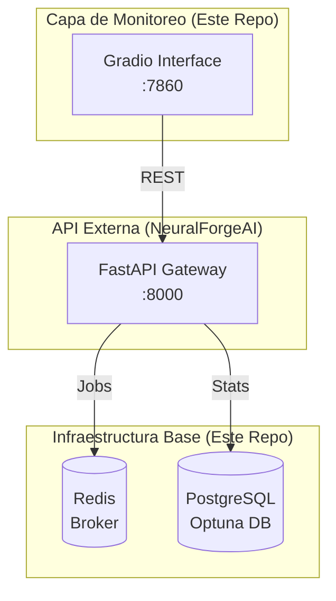

# wyoloservice2_control_server - Infraestructura y Monitoreo

Este repositorio se encarga de la **infraestructura base** y proporciona una **interfaz de monitoreo** secundaria para el ecosistema NeuralForgeAI.

## Estructura
- `environment/`: Configuraciones de Docker Compose para Redis (Broker) y PostgreSQL (Optuna DB).
- `interfaz/`: Dashboard de monitoreo construido con Gradio para supervisar tareas y workers.

## Arquitectura de Monitoreo



## Cambios Recientes
- La **API de Control (FastAPI)** se ha movido al repositorio **NeuralForgeAI/api** para consolidar la lógica de negocio con el frontend de React.
- Este repositorio ya no contiene la carpeta `api/` ni los tests de integración de la misma.

## Uso

### 1. Levantar Infraestructura
```bash
cd environment
docker-compose up -d
```

### 2. Levantar Panel Gradio
```bash
make start
```

La interfaz estará disponible en: `http://localhost:23444` (mapeado al puerto 7860 del contenedor).

---

**William R.** - AI Leader & Solutions Architect
