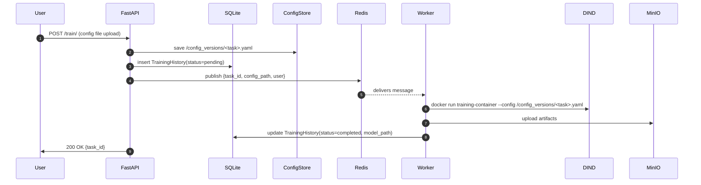
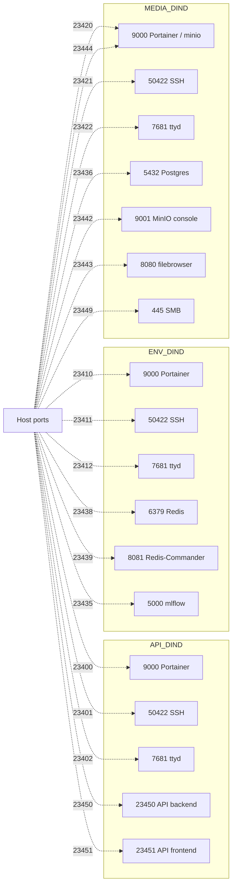

# WyoloService2 Control Server

**Logo suggestion:** a minimal mark combining a Docker whale silhouette with a server rack / control knobs — two-tone blue/gray.

---

## Table of Contents

1. Project Overview
2. Key Concepts & Components (quick)
3. Architectural Diagrams
   - High-level Flow (Mermaid)
   - Request Sequence (Mermaid)
   - Component Graph (Mermaid)
   - Container Lifecycle (Mermaid)
   - Deployment / Port Mapping (Mermaid)
4. Runtime Behavior & Lifecycle (concise)
5. Quick Start (developer)
6. API Reference (concise)
7. Configuration & Ports
8. File-by-File Guide
9. Troubleshooting & Observability
10. Contributing & Next Steps
11. License & Maintainer

---

## 1. Project Overview

WyoloService2 Control Server is a development-focused orchestration layer that runs multiple Docker-in-Docker (DIND) instances to provide isolated runtime sandboxes. It includes a FastAPI control plane that registers ML training/evaluation tasks, publishes them to a Redis queue, and relies on worker processes to run containerized training jobs using the internal DIND daemons. The repository bundles a lightweight DIND image with helper tooling (sshd, ttyd, Portainer runner) and a docker-compose manifest to run three environment sandboxes:

- dind_api
- dind_environment
- dind_media

Purpose: enable reproducible developer sandboxes, integration testing of ML pipelines, and isolated environment management without polluting the host Docker state.

---

## 2. Key Concepts & Components (quick)

- Control API (FastAPI) — registers tasks, persists metadata, publishes to Redis.
- Redis (queue) — message broker used to notify workers of new tasks.
- Workers / Runners — processes that consume Redis messages and run containerized training inside a DIND instance.
- DIND containers — full Docker daemons running inside containers, used to launch ephemeral training jobs.
- Artifact Storage — MinIO or mounted volumes for model artifacts.
- SQLite — lightweight local store for training history.

---

## 3. Architectural Diagrams

The diagrams below are generated in Mermaid and are authoritative for this README. They provide multiple views: high-level flow, request sequence, component graph, container lifecycle and port deployment.

### 3.1 High-level Flow

```mermaid
flowchart LR
  U[User / CI] -->|HTTP POST /train or /recreate| API[FastAPI Control API]
  API -->|save| CFG[Config Store (/config_versions)]
  API -->|persist| DB[(SQLite DB)]
  API -->|publish| RQ[(Redis Queue)]
  RQ -->|deliver| WK[Worker / Runner]
  WK -->|run| DIND[Docker-in-Docker]
  DIND -->|write| ART[Artifact Storage (MinIO/Volume)]
  API --- Port[Portainer / Admin UI]

  style API fill:#f9f,stroke:#333,stroke-width:1px
  classDef infra fill:#eef,stroke:#333
  class DIND,ART infra
```

Short: user request -> API -> persists config/DB -> publish to Redis -> worker executes inside DIND -> artifacts stored.


### 3.2 Request Sequence (detailed)



Notes: The worker can run inside any DIND instance (api/env/media) depending on routing or scheduling logic.


### 3.3 Component Diagram (static dependencies)

```mermaid
graph TD
  API[FastAPI - api/app]
  DB[(SQLite - /database/mlflow.db)]
  CFG[/config_versions]
  PORTS[ports_list.yaml]
  REDIS[(Redis)]
  WORKER[Worker]
  DIND_API[dind_api]
  DIND_ENV[dind_environment]
  DIND_MEDIA[dind_media]
  MINIO[MinIO / mlflow-minio]
  POSTGRES[(Postgres - media)]

  API --> DB
  API --> CFG
  API --> REDIS
  REDIS --> WORKER
  WORKER --> DIND_API
  WORKER --> DIND_ENV
  WORKER --> DIND_MEDIA
  DIND_MEDIA --> MINIO
  DIND_MEDIA --> POSTGRES
  PORTS --- DIND_API
  PORTS --- DIND_ENV
  PORTS --- DIND_MEDIA
```

This graph shows module-level dependencies. It is intentionally compact — use it as a reference map when modifying or debugging modules.


### 3.4 Container Lifecycle (build & runtime)

```mermaid
flowchart TD
  subgraph Build
    A1[FROM docker:dind]
    A2[apk add sshd,ttyd,curl,bash,shadow]
    A3[configure sshd]
    A4[COPY start.sh, control_host.env]
    A5[chmod +x start.sh]
    A6[IMAGE ready]
    A1 --> A2 --> A3 --> A4 --> A5 --> A6
  end

  subgraph Runtime
    R1[container start -> /usr/local/bin/start.sh]
    R2[start dockerd & wait until `docker info` succeeds]
    R3[start sshd, ttyd]
    R4[start portainer runner]
    R5[healthcheck: docker info -> healthy]
    R1 --> R2 --> R3 --> R4 --> R5
  end
```



Important: healthcheck uses `docker info` to determine readiness. DOCKER_TLS_CERTDIR is intentionally unset in runtime to allow client connectivity without TLS in the development image.


### 3.5 Deployment / Port Mapping (host -> container)



Reference: port assignments live in `ports_list.yaml`.

---

## 4. Runtime Behavior & Lifecycle (concise)

- Worker routing: messages published to a Redis topic are consumed by worker processes which decide which DIND to use (policy can be extended).
- Failure model: a failed task should update the DB record; workers should support retries and error reporting.
- Health monitoring: each DIND exposes a healthcheck which transitions to `healthy` after `docker info` succeeds.

---

## 5. Quick Start (developer) — concise

Prereqs: Docker, docker-compose (v2), zsh/bash.

1. Build and start the three DINDs:

```bash
cd /path/to/wyoloservice2_control_server
# Build images
docker-compose build --no-cache dind_api dind_environment dind_media
# Start services
docker-compose up -d dind_api dind_environment dind_media
```

2. Validate:

```bash
docker-compose ps
docker inspect --format='{{json .State.Health}}' dind_api
# Run hello-world inside each DIND
for s in dind_api dind_environment dind_media; do
  docker-compose exec -T $s sh -c 'until docker info >/dev/null 2>&1; do sleep 1; done; docker run --rm hello-world'
done
```

3. Example API call (start training):

```bash
curl -X POST "http://localhost:23450/train/" -F "user_code=myuser" -F "file=@./my_training_config.yaml"
```

---

## 6. API Reference (concise)

- POST /train/ : file Upload (config YAML), user_code, resume (bool)
- POST /recreate/ : parameters user_code, task_id, last_model, file upload
- POST /evaluate/ : user_code, data_yaml, model_path, topic
- POST /stop/ : user_code, file (used to stop via start_training resume=False)

See `api/app/main.py` for implementation details.

---

## 7. Configuration & Ports

- `ports_list.yaml` contains canonical host port assignments.
- `docker/control_host.env` and `docker/config_host.env` — runtime env files used by the DIND image.
- `api/app/config.yaml` (if present) is consumed by FastAPI; ensure paths (e.g. `/code/app/config.yaml`) match runtime mounts.
- DB path inside containers: `/database/mlflow.db` (created by `api/app/database.py`).

Security note: rotate passwords and avoid exposing SSH/Portainer to untrusted networks.

---

## 8. File-by-File Guide (concise)

- `docker-compose.yaml` — orchestrates DIND services and maps host ports.
- `docker/Dockerfile` — builds the DIND image (based on `docker:dind`).
- `docker/start.sh` — entrypoint that starts dockerd, sshd, ttyd and Portainer runner.
- `docker/control_host.env` — env file copied into image for host-specific settings.
- `ports_list.yaml` — host port map.
- `api/app/main.py` — FastAPI endpoints and queue publishing logic.
- `api/app/database.py` — Pydantic model + WSQLite instance.
- `api/app/config.yaml` — optional runtime config for the API.
- `api/data/dind-data/` — persisted docker data used as volume for api DIND.
- `environment/` & `media/` — per-environment app and data folders, used as mounts.

---

## 9. Troubleshooting & Observability

Common commands:

- Show containers & status:
  `docker-compose ps`

- Inspect health:
  `docker inspect --format='{{json .State.Health}}' dind_api`

- Follow logs:
  `docker logs -f dind_api`

- Run commands inside DIND:
  `docker-compose exec -T dind_api sh`
  then run `docker ps -a` inside the container to see internal containers.

- If port conflicts occur, update `ports_list.yaml` and `docker-compose.yaml` mapping.

- To remove orphan containers from previous compose changes:
  `docker-compose down --remove-orphans`

---

## 10. Contributing & Next Steps

- Add a dedicated `redis` service to `docker-compose.yaml` for local end-to-end testing.
- Implement a simple worker example in `workers/` that consumes Redis and runs a toy training container.
- Add CI job to validate the DIND build and run a hello-world inside each DIND.
- Consider migrating DB to small PostgreSQL for multi-process consistency if needed.

Contributions via PRs are welcome. Follow code style and include tests where applicable.

---

## 11. License & Maintainer

Maintainer: `wisrovi`

This project has no explicit license file in the repository root. Add a LICENSE file if you intend to open-source this project.

---

If you want I can also:
- add a small `workers/` example consumer that demonstrates end-to-end enqueuing and processing,
- add a `health-wait.sh` helper that other services can use to wait for DIND health,
- or remove the top-level `version:` key from `docker-compose.yaml` to silence warnings.