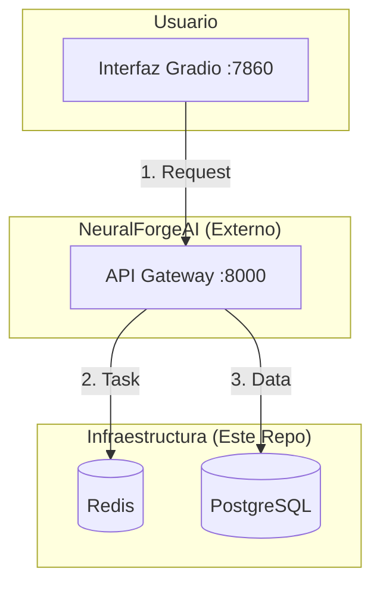

# Control Server - Infrastructure & Gradio Monitoring

Este repositorio contiene la **infraestructura base** (Redis, PostgreSQL) y una **interfaz de monitoreo Gradio** para el cluster NeuralForgeAI.

> ⚠️ **IMPORTANTE**: La API Gateway (FastAPI) ha sido trasladada al repositorio [NeuralForgeAI](https://github.com/wisrovi/NeuralForgeAI) para consolidarse con el frontend de React.

---

## 🏗️ Componentes de este Repositorio

1.  **Infraestructura (`environment/`)**: Contenedores de soporte como Redis (Broker) y PostgreSQL (Optuna DB).
2.  **Interfaz Gradio (`interfaz/`)**: Panel visual para monitoreo rápido de tareas, workers y lanzamiento de estudios delegando en la API externa.

---

## 🚶 Flujo de Trabajo Actualizado


```mermaid
flowchart TD
    subgraph "Usuario"
        G[Interfaz Gradio :7860]
    end

    subgraph "NeuralForgeAI (Externo)"
        API[API Gateway :8000]
    end

    subgraph "Infraestructura (Este Repo)"
        R[(Redis)]
        P[(PostgreSQL)]
    end

    G -->|1. Request| API
    API -->|2. Task| R
    API -->|3. Data| P
```

---

## 📂 Guía de Archivos

| Archivo/Carpeta | Propósito |
|-----------------|-----------|
| `interfaz/` | Aplicación Gradio para UI visual de monitoreo |
| `environment/` | Docker Compose de infraestructura (Redis, DB) |
| `docker-compose.api.yaml` | Orquestación de la interfaz Gradio |
| `Makefile` | Comandos para gestión de contenedores |

---

## Uso

### 1. Levantar Infraestructura
Entra en la carpeta `environment/` y levanta los servicios base.

### 2. Levantar Interfaz Gradio
Desde la raíz:
```bash
make start
```

La interfaz estará disponible en: `http://localhost:23444` (o puerto 7860 internamente).

---

## Configuración de Conexión

La interfaz Gradio necesita conocer la ubicación de la API:

```bash
# En docker-compose.api.yaml
environment:
  - API_URL=http://<IP_API_GATEWAY>:8000
```

---

**William R.** - AI Leader & Solutions Architect
