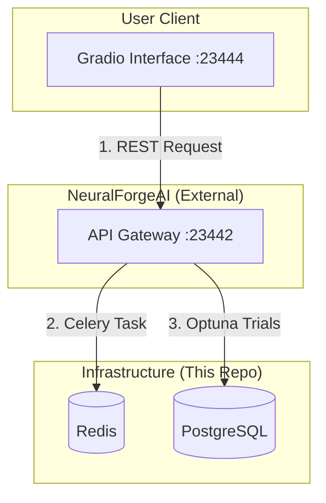

# Control Server - Infrastructure & Gradio Monitoring

This repository contains the **base infrastructure services** (Redis Broker, PostgreSQL Database) and a backup **Gradio monitoring UI** for the NeuralForgeAI training cluster.

> ⚠️ **IMPORTANT**: The main FastAPI API Gateway and React UI have been migrated to the [NeuralForgeAI](https://github.com/wisrovi/NeuralForgeAI) repository to unify the frontend and backend management stack.

---

## 🏗️ Repository Components

1.  **Infrastructure (`environment/`)**: Compose configurations running support datastores: Redis (Celery Message Broker) and PostgreSQL (Optuna Sweeper DB).
2.  **Gradio Interface (`interfaz/`)**: Back-up visual dashboard to inspect tasks queue and submit studies pointing to the API Gateway.

---

## 🚶 Process Workflow Diagram


```mermaid
flowchart TD
    subgraph "User Client"
        G[Gradio Interface :23444]
    end

    subgraph "NeuralForgeAI (External)"
        API[API Gateway :23442]
    end

    subgraph "Infrastructure (This Repo)"
        R[(Redis)]
        P[(PostgreSQL)]
    end

    G -->|1. REST Request| API
    API -->|2. Celery Task| R
    API -->|3. Optuna Trials| P
```

---

## 📂 Files & Folders Directory

| File / Folder | Purpose |
| :--- | :--- |
| `interfaz/` | Python Gradio app files for tasks visualization |
| `environment/` | Docker Compose files launching Redis and Postgres |
| `docker-compose.api.yml` | Orchestration config for the Gradio UI |
| `Makefile` | Utility tasks to build, run, and halt docker containers |

---

## ⚙️ How to Deploy

### 1. Start Support Databases (Redis & Postgres)
Navigate to the `environment/` directory and spin up docker-compose:
```bash
cd environment
docker compose up -d
```

### 2. Start Gradio UI
Run the Makefile target from the repository root:
```bash
make start
```
The interface will be exposed on: `http://localhost:23444` (mapping container port 7860).

---

## 🔌 Connection Settings
The Gradio web interface connects to the FastAPI Gateway:
```yaml
# In docker-compose.api.yaml
environment:
  - API_URL=http://<MASTER_IP>:23442
```

---

## 📜 Changelog & Version History

### Version 2.0.0 (Current Release) - 2026-07-03
*   **Port Mapping Refactoring:** Updated the API URL mapping to point to port `23442` (REST Gateway) and Gradio to port `23444`.
*   **Decoupled Stack Cleanup:** Cleaned old compose configurations to align with the React-based `WDarwin Ops` frontend.

### Version 1.0.0 (Initial Release) - 2026-02-10
*   FastAPI backend routing mapping Postgres and Redis services.
*   Gradio dashboard panel supporting study submits and Celery workers status polling.

---

**William R.** - AI Leader & Solutions Architect
