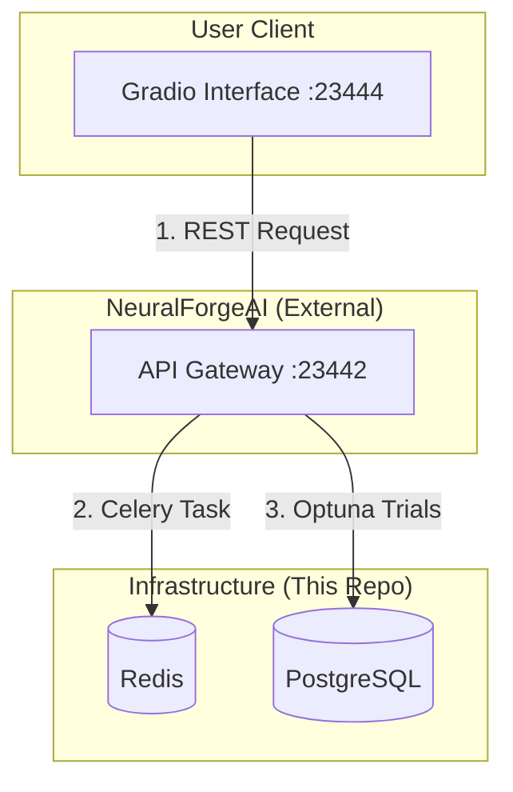

<p align="center">
  <a href="https://linkedin.com/in/wisrovi-rodriguez"></a>
  <a href="https://wisrovi.dev"></a>
  <a href="https://orcid.org/0009-0005-0710-1861"></a>
  <a href="https://opensource.org/licenses/MIT"></a>
</p>

# Control Server - Infrastructure & Gradio Monitoring

This repository contains the **base infrastructure services** (Redis Broker, PostgreSQL Database) and a backup **Gradio monitoring UI** for the NeuralForgeAI training cluster.

> ⚠️ **IMPORTANT**: The main FastAPI API Gateway and React UI have been migrated to the [NeuralForgeAI](https://github.com/wisrovi/NeuralForgeAI) repository to unify the frontend and backend management stack.

---

## 🏗️ Repository Components

1.  **Infrastructure (`environment/`)**: Compose configurations running support datastores: Redis (Celery Message Broker) and PostgreSQL (Optuna Sweeper DB).
2.  **Gradio Interface (`interfaz/`)**: Back-up visual dashboard to inspect tasks queue and submit studies pointing to the API Gateway.

---

## 🚶 Process Workflow Diagram


```mermaid
flowchart TD
    subgraph "User Client"
        G[Gradio Interface :23444]
    end

    subgraph "NeuralForgeAI (External)"
        API[API Gateway :23442]
    end

    subgraph "Infrastructure (This Repo)"
        R[(Redis)]
        P[(PostgreSQL)]
    end

    G -->|1. REST Request| API
    API -->|2. Celery Task| R
    API -->|3. Optuna Trials| P
```

---

## 📂 Files & Folders Directory

| File / Folder | Purpose |
| :--- | :--- |
| `interfaz/` | Python Gradio app files for tasks visualization |
| `environment/` | Docker Compose files launching Redis and Postgres |
| `docker-compose.api.yml` | Orchestration config for the Gradio UI |
| `Makefile` | Utility tasks to build, run, and halt docker containers |
| `monitor_training.py` | CLI tool to map active trials to invokers and get remote logging commands |

---

## ⚙️ How to Deploy

### 1. Start Support Databases (Redis & Postgres)
Navigate to the `environment/` directory and spin up docker-compose:
```bash
cd environment
docker compose up -d
```

### 2. Start Gradio UI
Run the Makefile target from the repository root:
```bash
make start
```
The interface will be exposed on: `http://localhost:23444` (mapping container port 7860).

---

## 🔌 Connection Settings
The Gradio web interface connects to the FastAPI Gateway:
```yaml
# In docker-compose.api.yaml
environment:
  - API_URL=http://<MASTER_IP>:23442
```

---

## 📊 Monitoring Training Logs

When you send a training study to a public queue, it is distributed among active invokers. To easily identify which invoker node has taken your task and fetch the training logs, you can run the helper monitoring script:

```bash
./monitor_training.py
```

This tool connects directly to the API, lists active tasks, finds the worker IP, and prints the exact `ssh` commands to stream live Docker logs or view the persistent log files on the corresponding GPU node.

---

## 📜 Changelog & Version History

### Version 2.1.0 (Current Release) - 2026-08-04
*   **Sweeper Hyperparameter Tuning:** Enabled `lr0`, `momentum`, `freeze`, and `optimizer` hyperparameters in the ArchitecturePlan segmentation `config_train.yaml`.
*   **Config Cleanup:** Removed unused `batch: -1` fields and commented `val`/`test` conf blocks from classification and detection dataset configs.

### Version 2.0.0 - 2026-07-03
*   **Port Mapping Refactoring:** Updated the API URL mapping to point to port `23442` (REST Gateway) and Gradio to port `23444`.
*   **Decoupled Stack Cleanup:** Cleaned old compose configurations to align with the React-based `WDarwin Ops` frontend.

### Version 1.0.0 (Initial Release) - 2026-02-10
*   FastAPI backend routing mapping Postgres and Redis services.
*   Gradio dashboard panel supporting study submits and Celery workers status polling.

---

**William R.** - AI Leader & Solutions Architect

## Licensing and Usage

This project uses a **PolyForm Noncommercial License** model:
- **Community/Research**: Licensed under the PolyForm Noncommercial. See [LICENSE](LICENSE).
- **Commercial**: Requires a commercial license. See [COMMERCIAL.md](COMMERCIAL.md) for details.

### Academic Research
If you use this project in academic research, you are required to cite this repository using the provided `CITATION.cff` and notify the author with a link to your publication.


## Changelog
- Bumped version due to License update to PolyForm Noncommercial and Dual Licensing model.

---

## 👤 Autor & Afiliación Oficial

* **William Steve Rodriguez Villamizar (Wisrovi)**
* **Cargo:** Principal AI Engineer & Applied AI Solutions Architect | Scientific Researcher
* 📧 **Email:** [wisrovi.rodriguez@gmail.com](mailto:wisrovi.rodriguez@gmail.com) / [wisrovi@wisrovi.dev](mailto:wisrovi@wisrovi.dev)
* 🌐 **Portal Oficial:** [wisrovi.dev](https://wisrovi.dev)
* 💼 **LinkedIn:** [wisrovi-rodriguez](https://www.linkedin.com/in/wisrovi-rodriguez/)
* 🆔 **ORCID:** [0009-0005-0710-1861](https://orcid.org/0009-0005-0710-1861)
* 📦 **PyPI:** [pypi.org/user/wisrovi/](https://pypi.org/user/wisrovi/)
* 🐙 **GitHub:** [@wisrovi](https://github.com/wisrovi)
