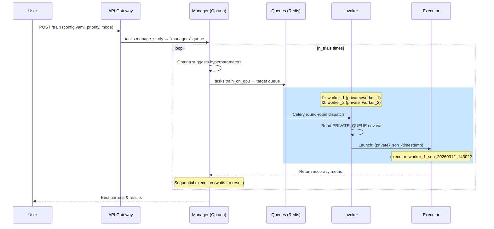

# Technical Flow - YAML Orchestration and Priority Queues

This document details the data flow from the moment a user submits a configuration until the final results are obtained.

## Architecture Overview

### Components

| Component | Description |
|-----------|-------------|
| **API Gateway** | FastAPI service that receives YAML configs and dispatches studies |
| **Manager** | Celery worker running Optuna studies (orchestrator) |
| **Invoker** | Worker that launches Executor containers |
| **Executor** | Docker container that runs actual ML training |

### Queues

```
┌─────────────────────────────────────────────────────────────────┐
│                         REDIS BROKER                             │
├─────────────┬─────────────┬─────────────┬─────────────┬────────┤
│  managers   │  gpus_high  │ gpus_medium │  gpus_low   │ worker_*
└─────────────┴─────────────┴─────────────┴─────────────┴────────┘
      ▲               ▲             ▲             ▲           ▲
      │               │             │             │           │
   Optuna         Invoker       Invoker       Invoker    Invoker
   Study         (any queue)   (any queue)   (any queue) (private)
```

## Task Lifecycle



## Queue Selection Logic

### 1. API Routing
Upon receiving a request, the API injects the `target_worker_queue` field into the `sweeper` object:
- **Public Mode**: Maps priority to queues: `high`→`gpus_high`, `medium`→`gpus_medium`, `low`→`gpus_low`
- **Private Mode**: Uses the worker name directly (e.g., `worker_1`)

### 2. Invoker Queue Subscription
Each Invoker subscribes to queues in strict priority order:

```bash
celery -A worker_gpu worker -Q ${PRIVATE_QUEUE},gpus_high,gpus_medium,gpus_low
```

**Order:**
1. Private Queue (highest) - e.g., `worker_1`
2. High Priority - `gpus_high`
3. Medium Priority - `gpus_medium`
4. Low Priority - `gpus_low`

This ensures **strict priority** behavior with `--concurrency=1`.

## Multiple Invokers on Same Machine

### Creating Invokers

```bash
# Invoker 1
./launcher_invoker.sh --private_name worker_1

# Invoker 2  
./launcher_invoker.sh --private_name worker_2
```

Each Invoker gets:
- Its own **private queue** (e.g., `worker_1`)
- Plus the **3 public queues** (`gpus_high`, `gpus_medium`, `gpus_low`)

### Task Distribution

When sending tasks to a public queue (e.g., `gpus_medium`) with multiple Invokers:

```
┌──────────────┐     ┌──────────────┐     ┌──────────────┐
│  Invoker 1   │     │  Invoker 2   │     │  Invoker 3   │
│ private: w1  │     │ private: w2  │     │ private: w3  │
└──────┬───────┘     └──────┬───────┘     └──────┬───────┘
       │                    │                    │
       ▼                    ▼                    ▼
    ┌─────────────────────────────────────────────┐
    │              gpus_medium queue              │
    │         (Celery round-robin)                │
    │   Task1  Task2  Task3  Task4  Task5  ...  │
    └─────────────────────────────────────────────┘
```

**Example:** 3 Invokers listening to `gpus_medium`, 6 tasks sent:
- Invoker 1: Task 1 → Task 4 → Task 7...
- Invoker 2: Task 2 → Task 5 → Task 8...
- Invoker 3: Task 3 → Task 6 → Task 9...

## Executor Naming

Each Executor container is named following the pattern:

```
{private_name}_son_{timestamp}
```

**Examples:**
- `worker_1_son_20260312_143022`
- `worker_2_son_20260312_145501`
- `invocador_1_son_20260312_151200`

This allows tracking which Invoker launched which Executor.

### Implementation

The Invoker reads the `PRIVATE_QUEUE` environment variable:

```python
invoker_name = os.getenv("PRIVATE_QUEUE", "unknown")
executor_name = f"{invoker_name}_son_{datetime.now().strftime('%Y%m%d_%H%M%S')}"
```

## API Endpoints

| Endpoint | Method | Description |
|----------|--------|-------------|
| `/train` | POST | Launch new study |
| `/workers` | GET | List active private workers |
| `/tasks` | GET | List queued tasks |
| `/tasks/{id}` | DELETE | Revoke task |
| `/tasks/{id}/requeue` | POST | Requeue with priority |
| `/status/{id}` | GET | Check study status |

## Environment Variables

| Variable | Description | Default |
|----------|-------------|---------|
| `REDIS_URL` | Redis connection | `redis://redis:6379/0` |
| `PRIVATE_QUEUE` | Private queue name | `worker_default` |
