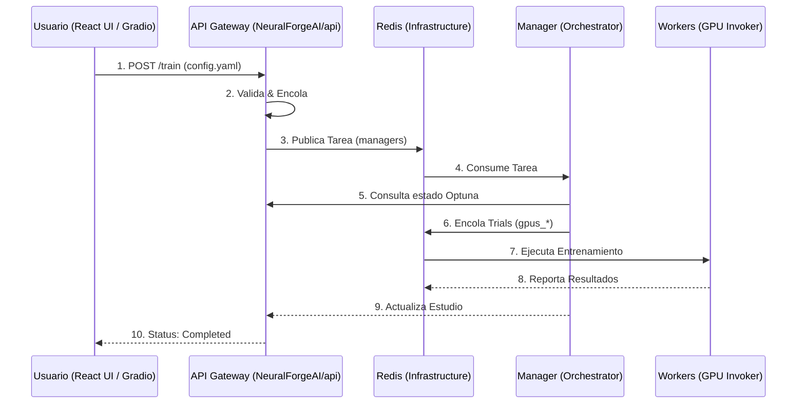

# NeuralForgeAI - Communication Flow

Este documento describe cómo interactúan los componentes del ecosistema tras la consolidación de la API en el repositorio NeuralForgeAI.

## 1. Diagrama de Secuencia General

## 2. Responsabilidades por Repositorio

### [NeuralForgeAI](https://github.com/wisrovi/NeuralForgeAI)
- **UI**: Interfaz principal para el usuario final.
- **API Gateway**: El único punto de contacto para lanzar y monitorear estudios. Maneja la lógica de validación y encolado.

### [wyoloservice2_control_server](https://github.com/wisrovi/wyoloservice2_control_server)
- **Infrastructure**: Hosting de Redis y PostgreSQL.
- **Monitoring GUI**: Interfaz Gradio para diagnósticos rápidos de bajo nivel.

### [wyoloservice2_manager](https://github.com/wisrovi/wyoloservice2_manager)
- **Orchestration**: Lógica de Optuna y gestión del ciclo de vida de los estudios.

### [wyoloservice2_invoker](https://github.com/wisrovi/wyoloservice2_invoker)
- **Execution**: Gestión de contenedores Docker en nodos GPU y montaje de datasets.
